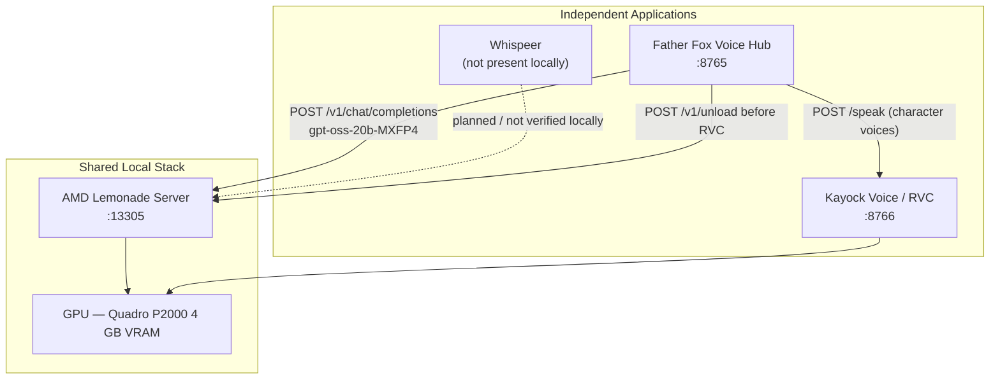
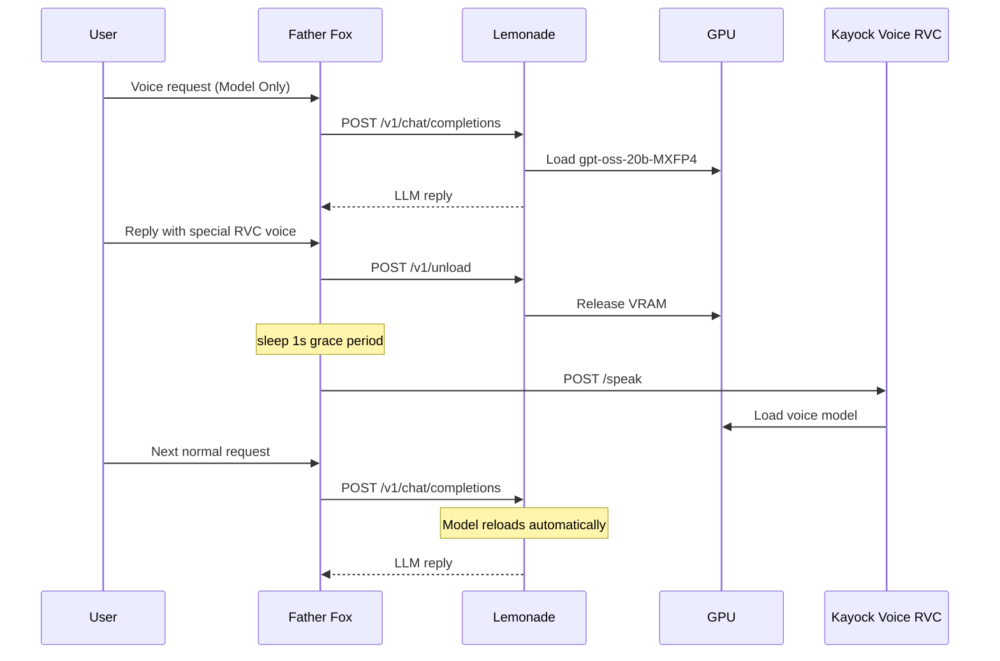

# Kayock Shared Local AI

**One Lemonade server. Multiple independent local-AI applications. Shared hardware. No cloud required.**

Entry for the [AMD Lemonade Developer Challenge](https://www.amd.com/en/developer/resources/technical-articles/2025/amd-lemonade-developer-challenge.html). This repository documents how multiple household applications share a single AMD Lemonade inference server on constrained local GPU hardware.

## What Is Verified Here

| Capability | Status | Source |
|------------|--------|--------|
| Father Fox → Lemonade (`gpt-oss-20b-MXFP4`) | **Verified in source** | [`integrations/father-fox/`](integrations/father-fox/) |
| Lemonade `/v1/unload` before RVC | **Verified in source** | [`integrations/rvc-handoff/`](integrations/rvc-handoff/) |
| VRAM release + RVC GPU handoff | **Verified in source** | [`docs/gpu-handoff.md`](docs/gpu-handoff.md) |
| Auto-reload on next Lemonade request | **Documented in source comments** | [`integrations/rvc-handoff/lemonade_unload.py`](integrations/rvc-handoff/lemonade_unload.py) |
| Whispeer → Lemonade | **Not found on this machine** | See [`docs/integrations.md`](docs/integrations.md) |
| Contest evidence log | **File not found** | See [`docs/contest-evidence.md`](docs/contest-evidence.md) |

## Architecture



## GPU Handoff Lifecycle



## Repository Layout

```
kayock-shared-local-ai/
├── README.md
├── LICENSE
├── SECURITY.md
├── docs/
│   ├── architecture.md
│   ├── contest-evidence.md
│   ├── gpu-handoff.md
│   ├── integrations.md
│   └── roadmap.md
├── integrations/
│   ├── father-fox/       # Lemonade chat completions
│   ├── whispeer/         # placeholder — source not found
│   └── rvc-handoff/      # unload + VRAM release
├── evidence/
│   ├── README.md
│   ├── verified-tests/
│   └── sanitized-logs/
└── governor/             # future work — AI Resource Governor
    └── README.md
```

## Quick Start (Reference)

These examples mirror patterns from Father Fox. Set credentials locally:

```bash
export LEMONADE_URL="http://127.0.0.1:13305"
export LEMONADE_API_KEY="your-local-key"
export LEMONADE_MODEL="gpt-oss-20b-MXFP4"
```

See [`integrations/father-fox/lemonade_chat.py`](integrations/father-fox/lemonade_chat.py) for a minimal chat-completions client and [`integrations/rvc-handoff/lemonade_unload.py`](integrations/rvc-handoff/lemonade_unload.py) for the GPU handoff unload call.

## Hardware Context

Father Fox documents a **NVIDIA Quadro P2000 with 4 GB VRAM**. The resident Lemonade LLM and RVC character voices cannot coexist on the GPU simultaneously — the handoff pattern exists specifically for this constraint.

## Future Work

The [Kayock AI Resource Governor](governor/README.md) is a planned self-optimizer for TTFT, TPS, VRAM, and multi-app scheduling. It is **not implemented** in this repository.

## License

MIT — see [LICENSE](LICENSE).
