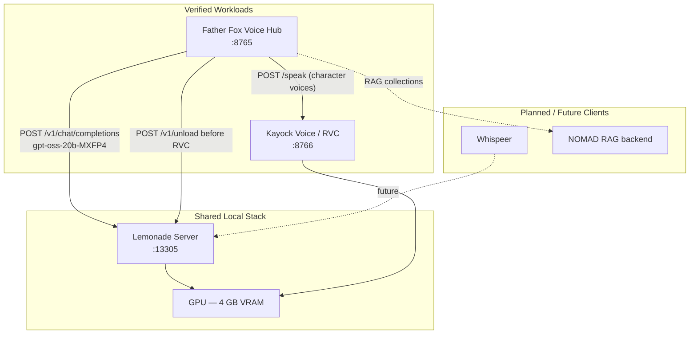
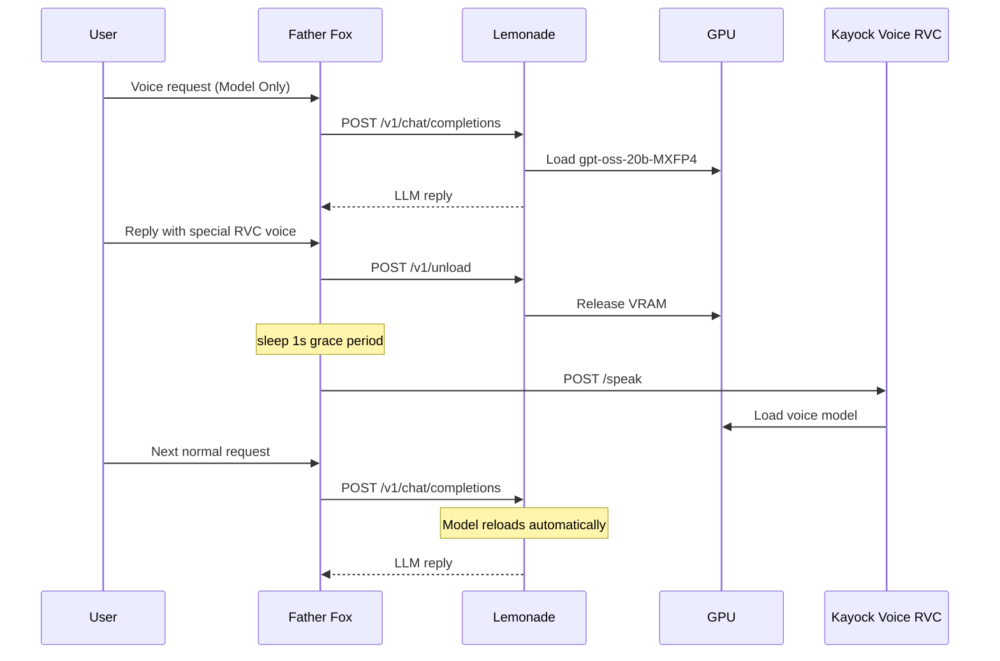

# Kayock Shared Local AI

**Lemonade inference and specialized RVC workloads dynamically sharing constrained local GPU resources.**

Entry for the [AMD Lemonade Developer Challenge](https://www.amd.com/en/developer/resources/technical-articles/2025/amd-lemonade-developer-challenge.html). This repository documents and demonstrates — with **runtime journal evidence** — how Father Fox Voice Hub coordinates Lemonade LLM inference (`gpt-oss-20b-MXFP4`) and RVC character voice synthesis on a single 4 GB GPU.

Lemonade is the OpenAI-compatible local runtime/API layer. The project runs on consumer hardware (verified on NVIDIA Quadro P2000); it is not limited to AMD GPUs.

## What Is Verified Here

| Capability | Status | Evidence type |
|------------|--------|---------------|
| Father Fox → Lemonade (`gpt-oss-20b-MXFP4`) | **Verified** | Runtime log + source |
| Lemonade `/v1/unload` before RVC | **Verified** | Runtime log + source |
| VRAM release + RVC GPU handoff | **Verified** | Runtime log + source |
| Return to Lemonade on next request | **Verified** | Runtime log (2026-09-01 00:20:15) |
| RVC `/api/talk` success after handoff | **Verified** | Runtime log (`200 OK`) |
| Whispeer / additional Lemonade clients | **Not demonstrated** | Planned — source absent locally |
| Kayock AI Resource Governor | **Planned** | Design only |

Evidence file: [`evidence/verified-tests/2026-09-01-father-fox-journal.md`](evidence/verified-tests/2026-09-01-father-fox-journal.md)

## Why This Matters

- **Local-first AI** — Voice conversations stay on your machine. Lemonade serves the LLM; Father Fox handles speech I/O.
- **Resource-constrained hardware** — A 4 GB GPU cannot hold a 20B model and RVC weights simultaneously. This project proves cooperative sharing instead of cloud offload.
- **Cooperative GPU use** — Explicit `POST /v1/unload` before RVC, automatic model reload on the next chat request. No Lemonade restart required.
- **Open-source reusable pattern** — Reference clients in [`integrations/`](integrations/) extract the handoff logic for adoption in other local apps.
- **No cloud inference required** — The verified session used only local Lemonade, Father Fox, and Kayock Voice RVC.

## Architecture



## GPU Handoff Lifecycle



*Sequence verified from runtime journal on 2026-09-01.*

## Repository Layout

```
kayock-shared-local-ai/
├── README.md
├── LICENSE
├── SECURITY.md
├── docs/
│   ├── architecture.md
│   ├── contest-evidence.md
│   ├── demo-script.md
│   ├── gpu-handoff.md
│   ├── integrations.md
│   └── roadmap.md
├── integrations/
│   ├── father-fox/       # Lemonade chat completions
│   ├── rvc-handoff/      # unload + VRAM release
│   └── whispeer/         # future client placeholder
├── evidence/
│   ├── verified-tests/   # runtime journal excerpts
│   └── sanitized-logs/
└── governor/             # AI Resource Governor (experimental on governor-v0.1)
    ├── README.md
    └── ...               # python -m governor CLI
```

## Quick Start (Reference)

```bash
export LEMONADE_URL="http://127.0.0.1:13305"
export LEMONADE_API_KEY="your-local-key"
export LEMONADE_MODEL="gpt-oss-20b-MXFP4"
```

See [`integrations/father-fox/lemonade_chat.py`](integrations/father-fox/lemonade_chat.py) and [`integrations/rvc-handoff/lemonade_unload.py`](integrations/rvc-handoff/lemonade_unload.py).

## Demo Recording

Follow [`docs/demo-script.md`](docs/demo-script.md) for a 2–3 minute contest video walkthrough.

## Hardware Context

Verified on a **NVIDIA Quadro P2000 (4 GB VRAM)**. Lemonade serves `gpt-oss-20b-MXFP4`; RVC character voices require a separate GPU allocation — coordinated via explicit unload.

## Kayock AI Resource Governor (governor-v0.1 branch)

**IMPLEMENTED BUT EXPERIMENTAL** — safe telemetry, benchmarking, and per-request optimization prototype. Does not modify Father Fox, Lemonade, or RVC.

```bash
pip install -r governor/requirements.txt
export LEMONADE_API_KEY="your-local-key"
python -m governor status
python -m governor benchmark    # requires live Lemonade
python -m governor dashboard    # http://127.0.0.1:8770
```

See [`governor/README.md`](governor/README.md) for architecture, safety model, and commands.

Whispeer and NOMAD remain **PLANNED / FUTURE** Lemonade clients — not demonstrated in this repository.

## License

MIT — see [LICENSE](LICENSE).
