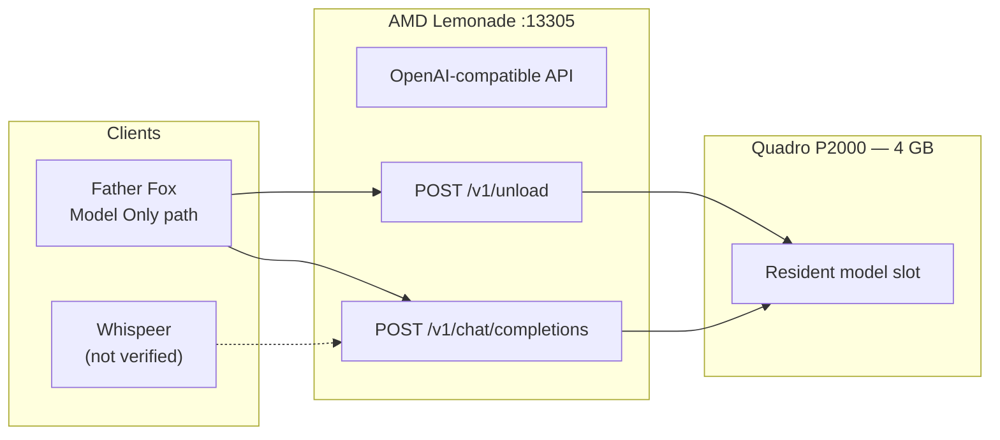

# Architecture

Kayock Shared Local AI is a documentation and reference repository describing how multiple independent applications share one AMD Lemonade inference server on a single machine with limited GPU memory.

## Design Principles

1. **One Lemonade server** — A single Lemonade process serves all LLM requests on the default port `13305`.
2. **Independent applications** — Each app (Father Fox, Whispeer, etc.) is a separate process with its own HTTP interface. They do not share code or state.
3. **Explicit GPU coordination** — When a GPU-heavy workload (RVC voice conversion) needs VRAM, applications call Lemonade's unload API before proceeding.
4. **No cloud dependency** — All inference runs locally via Lemonade and companion services.

## Component Map

| Component | Role | Default Endpoint | Verified |
|-----------|------|------------------|----------|
| AMD Lemonade | LLM inference (`gpt-oss-20b-MXFP4`) | `http://127.0.0.1:13305` | Yes (Father Fox source) |
| Father Fox Voice Hub | Speech → Whisper → LLM → TTS | `:8765` | Yes |
| Kayock Voice (RVC) | Character voice synthesis | `https://127.0.0.1:8766/speak` | Referenced in Father Fox |
| Whispeer | Social agent (planned integration) | Unknown | **Not found locally** |
| NOMAD / Ollama | RAG collections (non–Model Only) | `http://10.0.0.202:8080` | Legacy path in Father Fox |

## Shared Lemonade Architecture

## Father Fox Request Routing

Father Fox routes LLM requests based on the selected knowledge collection:

- **`Model Only`** → Lemonade directly (`/v1/chat/completions` with `gpt-oss-20b-MXFP4`)
- **Named collections** (electronics, health, etc.) → NOMAD/Ollama RAG backend (unchanged legacy path)

This split is visible in `ask_father_fox()` in the Father Fox source. Only the Model Only path uses Lemonade.

## Environment Configuration

Father Fox reads these environment variables (defaults shown):

| Variable | Default | Purpose |
|----------|---------|---------|
| `LEMONADE_URL` | `http://127.0.0.1:13305` | Lemonade base URL |
| `LEMONADE_API_KEY` | *(empty — required)* | Bearer token for Lemonade API |
| `LEMONADE_MODEL` | `gpt-oss-20b-MXFP4` | Model identifier for chat and unload |

## Concurrency

Father Fox uses an `asyncio.Lock` (`model_lock`) around the talk pipeline to serialize Whisper transcription, LLM calls, and voice generation per request. This prevents overlapping GPU-sensitive operations within a single Father Fox instance.

## Source References

All verified architecture claims trace to:

- `/home/kayock/father-fox-hub/app.py` (read-only inspection, September 2026)

No modifications were made to existing applications during this documentation effort.
