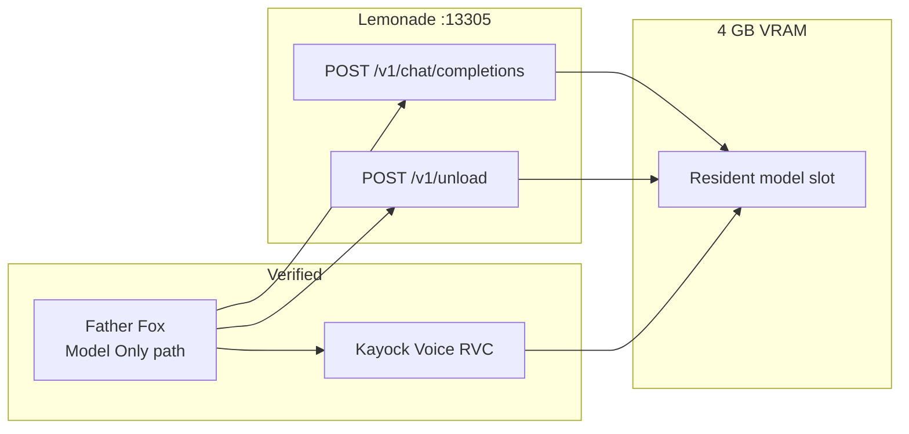

# Architecture

Kayock Shared Local AI documents how **Lemonade inference and specialized RVC workloads dynamically share constrained local GPU resources** on a single machine.

## What This Repository Demonstrates

**Verified today:** Father Fox Voice Hub (Lemonade LLM) + Kayock Voice RVC (character voices) coordinating on one 4 GB GPU.

**Not demonstrated here:** Whispeer, NOMAD, or other additional Lemonade clients. Those are documented as **PLANNED / FUTURE** integration targets.

## Design Principles

1. **Lemonade as runtime layer** — OpenAI-compatible local API (`/v1/chat/completions`, `/v1/unload`). Hardware-agnostic; verified on NVIDIA, compatible with AMD via Lemonade.
2. **Explicit GPU coordination** — Applications call Lemonade's unload API before loading a competing GPU workload.
3. **No cloud dependency** — Verified session used only local services.
4. **Reusable pattern** — Reference clients in `integrations/` for adoption by future apps.

## Component Map

| Component | Role | Endpoint | Evidence |
|-----------|------|----------|----------|
| Lemonade | LLM inference (`gpt-oss-20b-MXFP4`) | `http://127.0.0.1:13305` | Runtime log + source |
| Father Fox Voice Hub | Speech → Whisper → LLM → TTS | `:8765` | Runtime log + source |
| Kayock Voice (RVC) | Character voice synthesis | `https://127.0.0.1:8766/speak` | Runtime log + source |
| NOMAD / Ollama | RAG collections (non–Model Only) | `http://<nomad-host>:8080` | Source only; not Lemonade |
| Whispeer | Social agent | — | **PLANNED / FUTURE** |

## Verified Architecture

## Father Fox Request Routing

**VERIFIED FROM SOURCE CODE** — Father Fox routes by knowledge collection:

- **`Model Only`** → Lemonade (`/v1/chat/completions` with `gpt-oss-20b-MXFP4`)
- **Named collections** → NOMAD/Ollama RAG at `http://<nomad-host>:8080/api/ollama/chat` (legacy; not part of Lemonade demo)

## Environment Configuration

| Variable | Default | Purpose |
|----------|---------|---------|
| `LEMONADE_URL` | `http://127.0.0.1:13305` | Lemonade base URL |
| `LEMONADE_API_KEY` | *(required)* | Bearer token |
| `LEMONADE_MODEL` | `gpt-oss-20b-MXFP4` | Model for chat and unload |

## Concurrency

Father Fox serializes the talk pipeline with `asyncio.Lock` (`model_lock`) to prevent overlapping GPU-sensitive operations.

## Source References

- `/home/kayock/father-fox-hub/app.py` (read-only)
- Runtime journal: [`evidence/verified-tests/2026-09-01-father-fox-journal.md`](../evidence/verified-tests/2026-09-01-father-fox-journal.md)

No live applications were modified.
