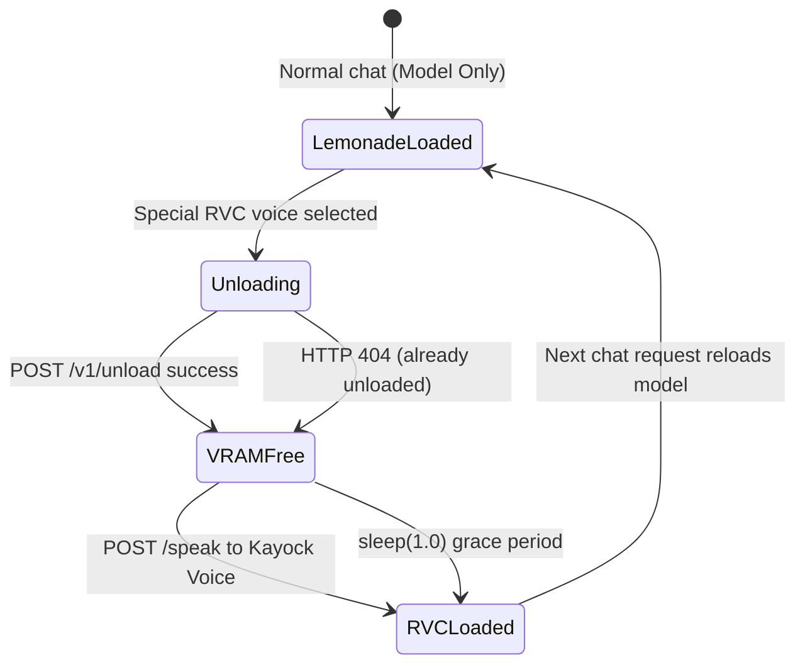
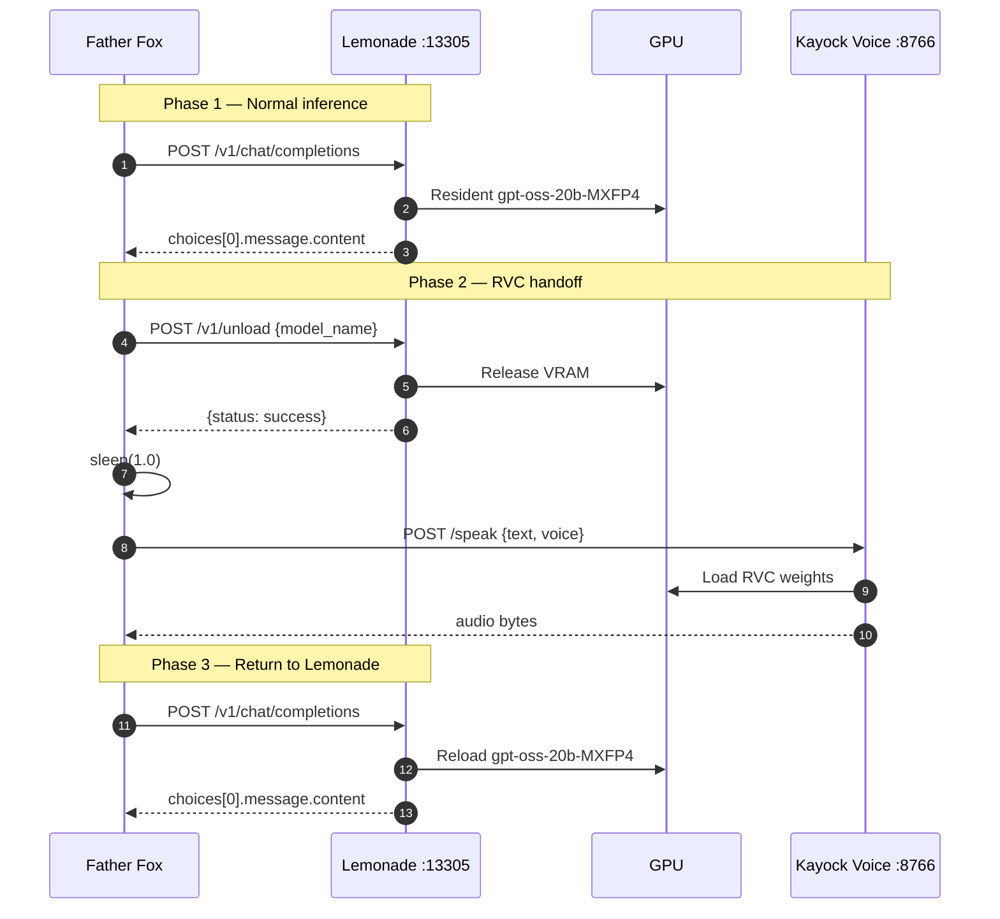

# GPU Handoff: Lemonade ↔ RVC

Father Fox runs on hardware with a **Quadro P2000 (4 GB VRAM)**. The resident Lemonade LLM (`gpt-oss-20b-MXFP4`) and RVC character voice models cannot fit on the GPU simultaneously. The handoff pattern releases Lemonade's model before loading RVC.

## Problem

```
┌─────────────────────────────────────┐
│  Quadro P2000 — 4 GB VRAM          │
│                                     │
│  gpt-oss-20b-MXFP4  +  RVC model   │
│         ✗ Does not fit              │
└─────────────────────────────────────┘
```

## Solution: Coordinated Unload

Before synthesizing speech with a special RVC voice, Father Fox:

1. Calls Lemonade `POST /v1/unload` to evict the resident LLM
2. Optionally calls `ollama stop` for any legacy Ollama models still resident
3. Waits 1 second for VRAM to return
4. Calls Kayock Voice RVC at `POST /speak`

On the **next normal chat request**, Father Fox calls `POST /v1/chat/completions` again. Lemonade reloads the model automatically — no Lemonade restart required.

## Lifecycle Diagram



## Sequence



## Special RVC Voices

Only these voices trigger the GPU handoff (from Father Fox source):

| Voice ID | Character |
|----------|-----------|
| `batman` | Batman |
| `optimus_prime` | Optimus Prime |
| `darth_vader` | Darth Vader |
| `iron_man` | Iron Man (RDJ) |

Standard Kokoro voices (`am_adam`, `af_heart`, etc.) do **not** trigger unload.

## Unload API Details

**Endpoint:** `POST {LEMONADE_URL}/v1/unload`

**Request body:**
```json
{
  "model_name": "gpt-oss-20b-MXFP4"
}
```

**Success response:** `{"status": "success"}`

**Already unloaded:** HTTP `404` — treated as success (no action needed)

**Headers:** `Authorization: Bearer {LEMONADE_API_KEY}`

## Legacy Ollama Cleanup

`release_ai_gpu_for_rvc()` also calls `release_ollama_gpu_for_rvc()`, which runs `ollama ps` and `ollama stop` for any resident models. This preserves compatibility with legacy Ollama workloads that may still occupy GPU memory.

## Reference Implementation

See [`integrations/rvc-handoff/`](../integrations/rvc-handoff/) for extracted reference code.

## Source

Extracted from `/home/kayock/father-fox-hub/app.py` — markers `FATHER_FOX_RVC_GPU_HANDOFF_V1` and `FATHER_FOX_LEMONADE_RVC_HANDOFF_V1`.
