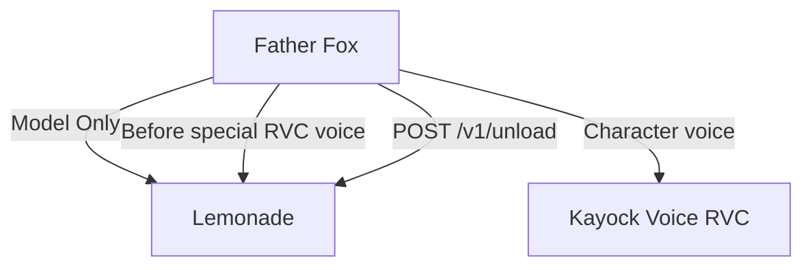

# Integrations

This repository **demonstrates** Father Fox + RVC GPU handoff with Lemonade. Other clients are listed only as future integration targets unless evidence appears locally.

## Father Fox Voice Hub — DEMONSTRATED

| Property | Value |
|----------|-------|
| Evidence | **VERIFIED FROM RUNTIME LOG** + source |
| Location | `/home/kayock/father-fox-hub/app.py` (read-only) |
| Port | `8765` |
| Lemonade path | `Model Only` → `/v1/chat/completions` |
| Model | `gpt-oss-20b-MXFP4` |
| GPU handoff | Yes — special RVC voices |

Father Fox: microphone audio → Faster Whisper (CPU) → Lemonade LLM → Kokoro or RVC TTS.

Reference: [`integrations/father-fox/`](../integrations/father-fox/)

## Kayock Voice (RVC) — DEMONSTRATED

| Property | Value |
|----------|-------|
| Evidence | **VERIFIED FROM RUNTIME LOG** (`POST /api/talk 200 OK`) |
| Endpoint | `https://127.0.0.1:8766/speak` |
| Role | Character voice synthesis after Lemonade unload |

Father Fox calls this service after releasing Lemonade VRAM. The RVC service is not copied into this repository.

## Whispeer — PLANNED / FUTURE

| Property | Value |
|----------|-------|
| Status | **Not demonstrated** — source absent on this machine |
| Expected path | `/home/kayock/kayock-social-agent` (does not exist) |

No Whispeer Lemonade integration is claimed in this contest submission. Placeholder: [`integrations/whispeer/`](../integrations/whispeer/)

## NOMAD / Ollama — LEGACY (NOT LEMONADE)

Father Fox routes named knowledge collections to a separate RAG backend:

```
http://<nomad-host>:8080/api/ollama/chat
```

This path does **not** use Lemonade and is **not demonstrated** in the contest demo. Documented for architectural completeness only.

## Verified Integration Flow



## Adding a Future Client

**PLANNED / FUTURE** — any new local app could share Lemonade by:

1. Setting `LEMONADE_URL`, `LEMONADE_API_KEY`, `LEMONADE_MODEL`
2. Calling `POST /v1/chat/completions` for inference
3. Calling `POST /v1/unload` before loading another GPU-heavy model

See [`governor/README.md`](../governor/README.md) for planned centralized scheduling.
