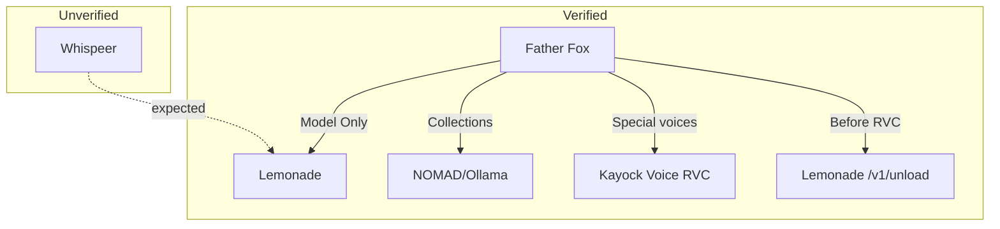

# Integrations

Overview of how each application connects to the shared Lemonade server.

## Father Fox Voice Hub

| Property | Value |
|----------|-------|
| Status | **Verified in source** |
| Location | `/home/kayock/father-fox-hub/app.py` |
| Port | `8765` |
| Lemonade path | `Model Only` collection → `/v1/chat/completions` |
| Model | `gpt-oss-20b-MXFP4` (via `LEMONADE_MODEL`) |
| GPU handoff | Yes — special RVC voices |

Father Fox is a FastAPI voice assistant: microphone audio → Faster Whisper (CPU) → LLM → Kokoro or RVC TTS.

Reference code: [`integrations/father-fox/`](../integrations/father-fox/)

## Whispeer

| Property | Value |
|----------|-------|
| Status | **Not found on this machine** |
| Expected path | `/home/kayock/kayock-social-agent` (does not exist) |
| Lemonade integration | **Unverified** |

A search of `/home/kayock` found no files matching `Whispeer`, `whispeer`, or `kayock-social-agent`. The integrations directory contains a placeholder describing the intended pattern.

Reference: [`integrations/whispeer/`](../integrations/whispeer/)

## Kayock Voice (RVC)

| Property | Value |
|----------|-------|
| Status | **Referenced by Father Fox** (not copied here) |
| Endpoint | `https://127.0.0.1:8766/speak` |
| Role | Character voice synthesis after Lemonade unload |

Father Fox calls this service after releasing Lemonade VRAM. The RVC service itself is not part of this repository.

## NOMAD / Ollama (Legacy RAG)

Father Fox still routes named knowledge collections to a separate backend:

```
http://10.0.0.202:8080/api/ollama/chat
```

This path does **not** use Lemonade. It is preserved for RAG-backed conversations (electronics, health, programming, etc.).

## Integration Comparison



## Adding a New Application

Any new local app can share Lemonade by:

1. Setting `LEMONADE_URL`, `LEMONADE_API_KEY`, and `LEMONADE_MODEL`
2. Calling `POST /v1/chat/completions` for inference
3. Calling `POST /v1/unload` before loading another GPU-heavy model
4. Relying on Lemonade to reload on the next chat request

See the [AI Resource Governor](../governor/README.md) for planned centralized scheduling (future work).
