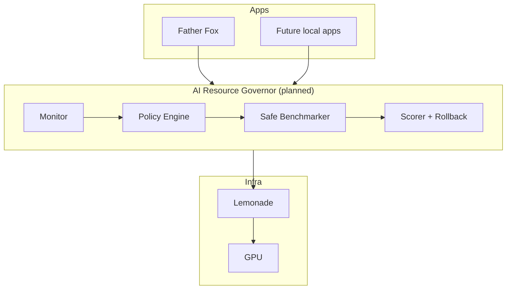

# Kayock AI Resource Governor

> **Status: PLANNED / FUTURE.** Nothing in this directory is implemented.

## Problem

Today, Father Fox manages GPU handoff independently — calling Lemonade's `/v1/unload` before loading RVC, sleeping a fixed grace period, then relying on automatic reload on the next chat request. Runtime evidence confirms this works (2026-09-01 journal), but the approach lacks:

- Centralized visibility into VRAM, TTFT, and TPS
- Coordinated scheduling across multiple apps
- Safe experimentation with inference parameters
- Automatic rollback when a change degrades performance

## Vision

The **Kayock AI Resource Governor** sits between applications and Lemonade as a local policy service. It does not replace Lemonade — it orchestrates *when* and *how* apps use it.

## Planned Metrics

| Metric | Abbreviation | Purpose |
|--------|--------------|---------|
| Time to first token | TTFT | Measure perceived latency for voice/chat |
| Tokens per second | TPS | Throughput under load |
| VRAM resident / free | VRAM | Track model occupancy and handoff success |
| GPU utilization | UTIL | Detect idle vs. saturated periods |
| Temperature | TEMP | Inference randomness per app profile |
| Context window | CTX | Right-size `ctx-size` per workload |
| Batch size | BATCH | Coordinate concurrent requests safely |
| CPU/GPU threads | THREADS | Tune backend parallelism |

## Planned Policy Dimensions

### App Priority

Interactive voice (Father Fox) should preempt lower-priority background tasks from future clients. Priority tiers would influence unload decisions and queue ordering.

### Unload / Reload Policy

Replace per-app fixed `sleep(1.0)` with measured VRAM-free confirmation:

1. Request unload via Lemonade API
2. Poll VRAM until below threshold or timeout
3. Grant GPU lease to requesting app (RVC, etc.)
4. On lease expiry, allow next chat request to reload

### Safe Benchmarking

Before applying a configuration change (context size, thread count, reasoning effort):

1. Snapshot current metrics as baseline
2. Run a short, bounded probe request
3. Score against baseline
4. Roll back if TTFT or TPS regresses beyond tolerance

### Scoring

A composite score weighting TTFT (latency-sensitive), TPS (throughput), and VRAM headroom (stability). Weights would be configurable per app profile.

### Rollback

Every policy change stores the previous configuration. Failed benchmarks or error-rate spikes trigger automatic revert.

## Relationship to Current Code

Father Fox already implements the **minimal handoff** the Governor would generalize:

| Father Fox today | Governor future |
|------------------|-----------------|
| Per-app `POST /v1/unload` | Centralized unload orchestration |
| Fixed 1s sleep | VRAM-polling with timeout |
| No metrics collection | Continuous TTFT/TPS/VRAM monitoring |
| No cross-app awareness | Priority queue across apps |

See [`integrations/rvc-handoff/`](../integrations/rvc-handoff/) for the current reference implementation.

## Non-Goals (Initial Design)

- Replacing Lemonade or running custom inference
- Cloud offload or hybrid routing
- Modifying existing application code without opt-in

## Implementation Status

| Component | Status |
|-----------|--------|
| Metric collection daemon | Not started |
| Policy engine | Not started |
| Safe benchmark harness | Not started |
| Scoring / rollback | Not started |
| Application SDK | Not started |

This remains design documentation until implementation begins.
