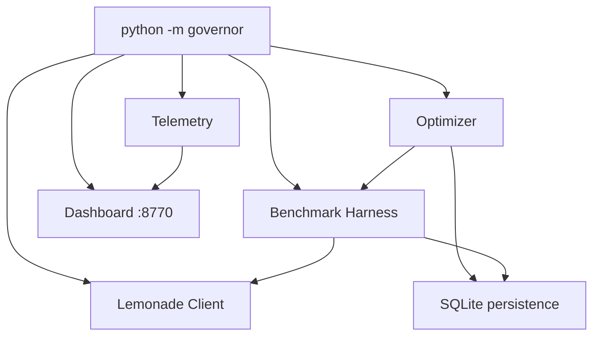

# Kayock AI Resource Governor

**Status: IMPLEMENTED BUT EXPERIMENTAL (v0.1)**

Safe local prototype for observing GPU/CPU telemetry, benchmarking Lemonade inference, and deterministically optimizing per-request software settings. Does **not** modify Father Fox, Lemonade, RVC, NOMAD, or Whispeer.

## What v0.1 Does

| Component | Status |
|-----------|--------|
| Telemetry (`status`) | **VERIFIED** — nvidia-smi + psutil |
| Lemonade health/models | **VERIFIED** — HTTP API (requires `LEMONADE_API_KEY`) |
| Benchmark harness | **IMPLEMENTED BUT EXPERIMENTAL** |
| Workload profiles | **VERIFIED** — bounds + definitions |
| Deterministic optimizer | **IMPLEMENTED BUT EXPERIMENTAL** |
| Handoff observer | **VERIFIED** — telemetry-based state inference |
| Web dashboard | **IMPLEMENTED BUT EXPERIMENTAL** |
| Load-time ctx-size apply | **PLANNED** — documented, not auto-applied |
| Father Fox integration | **PLANNED** — observe only |

## Safety Model

- **Read-only hardware** — uses `nvidia-smi` and psutil; no voltage, clock, or firmware changes
- **No root required** — user-space only
- **No service disruption** — does not stop Father Fox, Lemonade, or RVC
- **Bounded parameters** — only `max_tokens` and `temperature` are auto-tuned (per-request)
- **Explicit rollback** — failed candidates rejected; best-known config restored
- **No LLM-driven commands** — all changes from fixed allow-lists

## Architecture



## Commands

From repository root (`/home/kayock/kayock-shared-local-ai`):

```bash
pip install -r governor/requirements.txt

export LEMONADE_URL="http://127.0.0.1:13305"
export LEMONADE_API_KEY="your-local-key"
export LEMONADE_MODEL="gpt-oss-20b-MXFP4"

python -m governor status
python -m governor status --json

python -m governor benchmark
python -m governor benchmark --json

python -m governor optimize --profile LOW_LATENCY
python -m governor optimize --baseline-only

python -m governor profiles
python -m governor handoff
python -m governor handoff --lifecycle

python -m governor dashboard
```

## Supported Metrics

| Metric | Source | Notes |
|--------|--------|-------|
| GPU name | nvidia-smi | |
| GPU utilization | nvidia-smi | |
| VRAM used/free/total | nvidia-smi | |
| GPU temperature | nvidia-smi | |
| GPU clock | nvidia-smi | May be `[N/A]` on idle P2000 |
| Power draw/limit | nvidia-smi | Often `[N/A]` on Quadro P2000 |
| Throttle reasons | nvidia-smi -q | Active clock event reasons |
| CPU / RAM | psutil | |
| Lemonade online | HTTP `/health` | Requires API key |
| Models list | HTTP `/v1/models` | |

Unsupported metrics report as `unavailable` without failing.

## Verified Measured Results (2026-09-01)

**VERIFIED** — live `python -m governor benchmark` against `gpt-oss-20b-MXFP4` on Quadro P2000.

Full report: [`evidence/benchmark-results-2026-09-01.md`](evidence/benchmark-results-2026-09-01.md)

| Metric | Measured |
|--------|----------|
| Config | `max_tokens=128`, `temperature=0.7` |
| Avg TTFT | 7.15 s |
| Avg TPS | 7.01 |
| Avg total time | 8.97 s |
| Peak VRAM | 3191 MiB |
| Peak temperature | 57 °C |
| Errors | 0 |

Per-prompt TTFT ranged **3.62–11.46 s** (first prompt includes model-load penalty). TPS ranged **4.00–10.19**.

**Optimization:** No multi-candidate `LOW_LATENCY` optimization results were persisted (`benchmark_runs` table empty; SQLite decision rows are unit-test artifacts only). Performance **improvement from the optimizer cannot be verified** from stored measurements. Re-run `python -m governor optimize --profile LOW_LATENCY` to generate decision logs.

Post-benchmark service check: Father Fox **active**, Lemonade `/health` **HTTP 200**.

## Adjustable Parameters (v0.1)

### Auto-tuned (per-request, safe)

| Parameter | Min | Max |
|-----------|-----|-----|
| `max_tokens` | 16 | 1024 |
| `temperature` | 0.0 | 1.5 |

### Documented only (load-time — PLANNED)

| Parameter | Allow-list | Notes |
|-----------|------------|-------|
| `ctx_size` | 2048, 4096, 6144, 8192 | Requires model reload; not auto-applied |
| `llamacpp` backend | via `lemonade run --llamacpp` | CLI load-time only |

Lemonade CLI on this machine supports `--ctx-size`, `--llamacpp-args`, etc. The Governor records these in profiles but does **not** reload models without explicit future `--allow-reload` flag.

## Workload Profiles

| Profile | Priority | Default max_tokens |
|---------|----------|-------------------|
| `LOW_LATENCY` | TTFT | 96 |
| `THROUGHPUT` | TPS | 512 |
| `BACKGROUND` | efficiency | 256 |
| `GPU_HANDOFF` | VRAM release | 64 |

External apps (Father Fox, Whispeer) are **not integrated** — profiles are conceptual targets for optimization scoring.

## Handoff Awareness

Observer states (from documented Father Fox lifecycle):

1. `AI_INFERENCE_ACTIVE` / `AI_INFERENCE_IDLE`
2. `GPU_MEMORY_PRESSURE` (free VRAM below threshold)
3. `MODEL_UNLOAD_REQUIRED` / `GPU_RELEASED` (external signals)
4. `AI_SERVICE_RESTORATION`

Does not call `/v1/unload` — see [`integrations/rvc-handoff/`](../integrations/rvc-handoff/) for the production handoff pattern.

## Optimizer Flow

```
MEASURE baseline → GENERATE ≤6 candidates → BENCHMARK each
    → SCORE → KEEP if improved → else REJECT/ROLLBACK
    → SAVE winning profile to SQLite
```

Every decision logged with timestamp, configs, TTFT, TPS, VRAM, temperature, score, and reason.

## Persistence

Runtime data in `governor/data/` (gitignored):

- `governor.sqlite` — benchmarks, decisions, events, saved profiles
- `benchmark_*.json` — individual benchmark run exports

## Dashboard

`python -m governor dashboard` → `http://127.0.0.1:8770`

Shows GPU, Lemonade status, handoff state, optimizer results, recent events/decisions.

## Tests

```bash
pip install pytest
cd /home/kayock/kayock-shared-local-ai
python -m pytest governor/tests/ -v
```

Tests mock hardware where needed; no GPU settings changed.

## Limitations

- No automatic Lemonade model reload / ctx-size changes in v0.1
- No direct Father Fox / RVC control
- Token counts estimated from streamed text when usage metadata absent
- Benchmark requires live Lemonade + API key
- P2000 may not expose power metrics

## Future Work (PLANNED)

- VRAM-polling handoff coordinator (replace fixed sleep)
- Opt-in `--allow-reload` for ctx-size benchmarks with reload penalty measurement
- Father Fox opt-in callback for handoff events
- Multi-app priority queue
- AMD GPU telemetry via ROCm where available

## Related Documentation

- [Contest GPU handoff evidence](../docs/gpu-handoff.md)
- [Father Fox integration reference](../integrations/rvc-handoff/)
